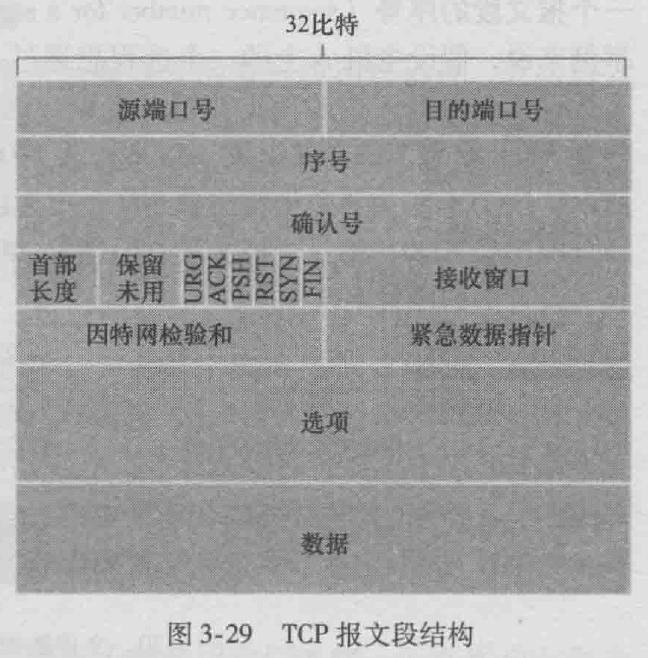

-   传输层服务：编址、复用、流控制、面向连接、可靠传输

-   可靠传输要解决的7个问题

    -   按序交付：序列号

    -   重传策略：超时计时器

    -   副本检测：以序列号区分，要求序列号空间足够大

    -   流量控制

        -   滑动窗口机制的设计

        -   信用量窗口

        -   TCP复合的窗口管理方式

            -   基于接收方缓冲区

            -   基本机制和工作流程

    -   连接建立：三次握手

    -   连接终止：四次挥手

        -   可靠网络与不可靠网络下连接建立与终止的算法对比

        -   三次握手的流程图与其必要性

    -   崩溃恢复：计时器或RST

-   传输层协议：UDP，TCP

-   TCP协议

    -   基本服务

    -   协议首部格式

-   32bit序号字段(sequence number field)，32bit确认号字段(acknowledgment number
    field)：可靠数据传输服务

    -   报文段的序号是报文段首字节的的字节流编号

    -   确认号是主机期望从另一主机收到的下一字节的序号

    -   TCP只确认从该流中至第一个丢失字节为止的字节 累计确认

-   16bit接收窗口字段(receive window
    field)：流量控制，指示接收方愿意接受的字节数量

-   4bit首部长度字段(header length field)：指示了以32bit的字为单位的TCP首部长度

    -   由于TCP选项字段的原因，TCP首部的长度可变

    -   通常该长度为20字节

-   可选与变长的选项字段(options field)

-   6bit标志字段(flag field)

    -   ACK, RST SYN FIN

-   TCP拥塞控制算法

    -   时延RTT估计算法

        -   SampleRTT：从报文段的发出到对报文段的确认被收到之间的时间量

            -   在任意时刻仅为一个已发送但目前未被确认的报文段估计SampleRTT

            -   不为已被重传的报文段计算SampleRTT

        -   EstimatedRTT：维持SampleRTT的均值

            -   $$\text{EstimateRTT} = \left( 1 - \alpha
                \right)*\text{EstimatedRTT} + \alpha*\text{SampleRTT}$$

            -   指数加权平均移动(Exponential Weighted Moving Average, EWMA)

            -   $$\text{DevRTT} = \left( 1 - \beta \right)*\text{DevRTT} +
                \beta*\left| \text{SampleRTT} - \text{EstimatedRTT} \right|$$

        -   超时重传间隔：$$\text{TimeoutInterval} = \text{EstimatedRTT} +
            4*\text{RTT}$$

            -   推荐初始TimeoutInterval为1s

            -   出现超时后TimeoutInterval值加倍

    -   RTO(retransmission timeout)计时器管理算法

        -   $$\text{RTO}\left( k + 1 \right) =
            \text{Min}(\text{UBOUND},\text{MAX}\left(
            \text{LBOUND},\beta*\text{SRT}T\left( k + 1 \right)) \right))$$

        -   Jacobson’s Reno

            -   慢启动

                -   cwnd(Congestion Window)的值设置为一个MSS(maximum segment
                    size)的较小值

                -   cwnd的值以1个MSS开始，**每**当传输的报文段首次被确认就增加1个MSS（事实上是在翻倍）

                -   何时结束

                    -   存在一个由超时指示的丢包（即拥塞）

                        -   将ssthresh（慢启动阈值）设置为cwnd/2

                        -   将cwnd设置为1并重新开始慢启动

                    -   cwnd的值等于ssthresh时

                        -   结束慢启动并进行拥塞避免模式

                    -   检测到3个冗余ACK

                        -   执行快速重传并进入快速回复状态

            -   拥塞避免：窗口增长基本算法（AIMD）

                -   此时cwnd的值大约时上次遇到拥塞时的一半

                -   每个RTT只讲cwnd的值增加一个MSS

                    -   每个到达ACK增加MSS/cwnd字节的cwnd

                -   何时结束

                    -   超时：与慢启动相同

                    -   3个冗余ACK

                        -   将ssthresh的值记录为cwnd的值的一半

                        -   cwnd的值减半

                        -   进入快速恢复状态

            -   快速重传

                -   触发条件：TCP发送方接收到对相同数据的3个冗余ACK

                -   说明这个已被确认过3次的报文段之后的报文段已经丢失

            -   快速恢复

                -   cwnd设置为上一个阈值+1

                -   进入拥塞避免状态

-   数据网络中的拥塞控制

    -   拥塞问题

        -   情况1：2个发送方和一台具有无穷大缓存的路由器

            -   接近吞吐量会使得平均时延迅速增加

        -   情况2：2个发送方和一台具有有限缓存的路由器

            -   发送方必须执行重传以补偿丢失分组

            -   吞吐量渐进为R/4

        -   情况3：4个发送方和具有优先缓存的多台路由器及多跳路径

            -   当一个分组沿一个路径被丢弃时，每个上有路由器用于转发该分组到丢弃该分组而使用的传输容量都被浪费掉了

    -   网络拥塞和性能指标

        -   keep number of packets below level

    -   拥塞情况下网络吞吐率特征

        -   delay and throughput

        -   power = thoughput/delay

    -   拥塞控制方式

        -   抑制分组（拥塞分组）control packet

            -   generated at congested node

            -   send to source node

        -   反压（逐跳）hop-by hop choke packet

        -   警告位 warning bit

            -   special bits set in the packet header by switch

            -   Backwards

                -   Congestion avoidance in opposite directionto congested
                    packet

                -   Assume congestion will burst up quickly

            -   Forwards

                -   Congestion avoidance in same directionas congested packet

                -   Assume congestion will cumulateslowly

        -   拥塞窗口（TCP）

        -   随机早期丢弃（RED）random early discard

            -   router randomly discards packets befor buffer becomes completely
                full

            -   compute average queue length

                -   $$\text{av}gLen = \left( 1 - \omega \right)*\text{avgLen} +
                    \omega*\text{sam}\text{pleLen}$$

            -   minThreshold, maxThreshold

        -   流量整形：漏桶机制，令牌桶机制

            -   漏桶机制Leak Bucket

            -   令牌桶机制Token Bucket

-   网络服务质量

    -   不同类型应用对QoS要求

        -   弹性流量和非弹性流量

    -   综合服务体系与区分服务

        -   基本思想和差别

        -   区分服务中SLA的概念
